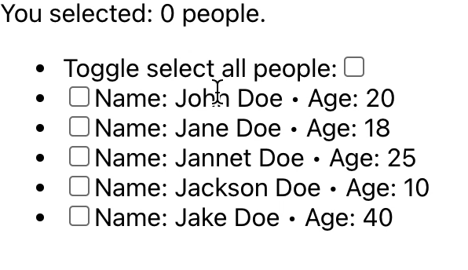

# ☑️ useSelection

> 🪝 A react hook for handling items selection in a list.

[](https://www.npmjs.com/package/use-selection) [](https://standardjs.com)

## 🤳🏽 useSelection on steroids

See `useSelection` hook in action.



## 📦 Install

```bash
npm install --save use-selection
```

## 🪝 Usage

```jsx
import React, { useState } from 'react';

import useSelection from 'use-selection';

const Example = () => {
  const [people] = useState([
    {
      name: 'John Doe',
      age: 20
    },
    {
      name: 'Jane Doe',
      age: 18
    },
    {
      name: 'Jannet Doe',
      age: 25
    },
    {
      name: 'Jackson Doe',
      age: 10
    },
    {
      name: 'Jake Doe',
      age: 40
    }
  ]);

  const {
    itemsListContainerRef,
    selectedItems,
    handleToggleSelect,
    handleToggleSelectAll
  } = useSelection();

  return (
    <>
      You selected: {selectedItems.length} people.
      <ul ref={itemsListContainerRef}>
        <li>
          <label htmlFor='selectAll'>Toggle select all people:</label>
          <input
            type='checkbox'
            id='selectAll'
            checked={selectedItems.length === people.length}
            onChange={(event) => handleToggleSelectAll(event, people.length)}
          />
        </li>

        {people.map((person, index) => (
          <li key={index}>
            <input
              type='checkbox'
              onChange={(event) => handleToggleSelect(event, index)}
            />

            <span>
              Name: {person.name} &bull; Age: {person.age}
            </span>
          </li>
        ))}
      </ul>
    </>
  );
};

export default Example;
```

### 💜 TypeScript usage example

```tsx
import React, { FC, useState } from 'react';

import useSelection from 'use-selection';

const App: FC = () => {
  const [people] = useState([
    {
      name: 'John Doe',
      age: 20
    },
    {
      name: 'Jane Doe',
      age: 18
    },
    {
      name: 'Jannet Doe',
      age: 25
    },
    {
      name: 'Jackson Doe',
      age: 10
    },
    {
      name: 'Jake Doe',
      age: 40
    }
  ]);

  const {
    itemsListContainerRef,
    selectedItems,
    handleToggleSelect,
    handleToggleSelectAll
  } = useSelection<HTMLUListElement>();

  return (
    <>
      You selected: {selectedItems.length} people.
      <ul ref={itemsListContainerRef}>
        <li>
          <label htmlFor='selectAll'>Toggle select all people:</label>
          <input
            type='checkbox'
            id='selectAll'
            checked={selectedItems.length === people.length}
            onChange={(event) => handleToggleSelectAll(event, people.length)}
          />
        </li>

        {people.map((person, index) => (
          <li key={index}>
            <input
              type='checkbox'
              onChange={(event) => handleToggleSelect(event, index)}
            />

            <span>
              Name: {person.name} &bull; Age: {person.age}
            </span>
          </li>
        ))}
      </ul>
    </>
  );
};

export default App;
```

## License

MIT © [Victor Aremu](https://github.com/ahkohd)
